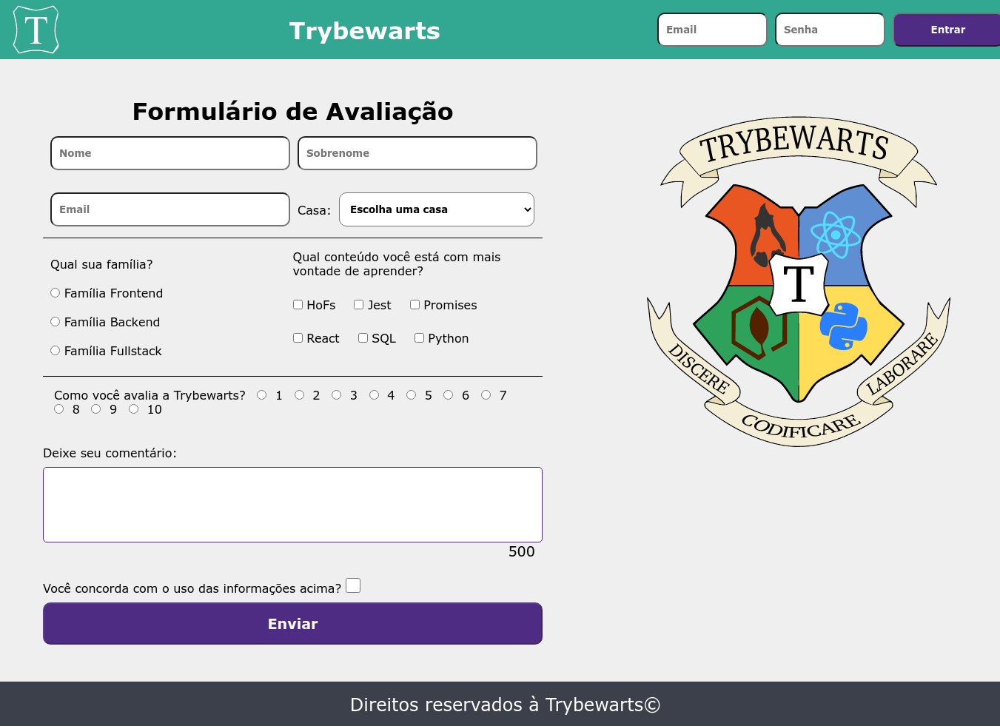

# Welcome to the Trybewarts Wizarding School project repository! 🧙

Here you will find the trybewarts project, a page with a student registration form. Developed by [Lucas Ximenes](https://www.linkedin.com/in/lucasdximenes/).

# Mandatory requirements

## 1. Create a green bar at the top of the page

  

The bar must have the <code>header</code> class, be a <code>flex container</code> and have the background color <code>rgb(50, 167, 145)</code>
  
 

- Create an element that has the class equal to `header`;
- Make the header a `flex container`;
- Add to the element with the `header` class the background color `rgb(50, 167, 145)`;

**What will be tested:**

- There is an element with the `header` class;
- The element has the `display: flex` CSS property;
- The element has the `background-color: rgb(50, 167, 145)` CSS property.

## 2. Add the Trybewarts logo

  

    The logo must be inside the <code>header</code> and be an <code>img</code> element
  
 

- Create an `img` tag inside the element with the `header` class:
  - Add the `trybewarts-header-logo` class;
  - Add the `src` attribute with the value `images/trybewarts-header-logo.svg`;

**What will be tested:**

- There is an `img` element with the `trybewarts-header-logo` class;
- The element has the `src` attribute pointing to `images/trybewarts-header-logo.svg`.

## 3. Add a login form to the `header`

  

    The login form must contain <code>email</code>, <code>password</code> and a login button and must be positioned to the right of the logo.
  
 

- Create a form with the `trybewarts-login` class;
- Create the **email** input inside the form:
  - Add the `name` attribute with the value **email**;
  - Add the `placeholder` attribute with the value **Email**;
- Create the **password** input inside the form:
- Add the `name` attribute with the value **password**;
- Add the `placeholder` attribute with the value **Password**;
- Create a button with the text **"Enter"**;
- Make the form a **flex container**;
- Make the form to the right of the logo;
- Validate the form:
  - By filling out the form and clicking on the button, it will be validated that:
    - If the email is **"tryber@teste.com"** and the password is **"123456"**, an alert will be issued containing the text **"Hello, Tryber!"**;
    - In all other cases, an alert must be issued containing the text **"Invalid email or password."**;

**Looking at the tip 👀:** add the `flex` property that makes the elements have the maximum spacing **between them** in the **header**

**What will be tested:**

- There is a `form` element with the `trybewarts-login` class;
- There is an input with the `name` attribute equal to **email** and the `placeholder` equal to **Email**;
- There is an input with the `name` attribute equal to **password** and the `placeholder` equal to **Password**;
- There is a button with the text `Enter`;
- The form has the `display: flex` CSS property;
- The `form` element is to the right of the logo;
- Clicking on the login button triggers an `alert` with the text `Invalid email or password`, in case of data filling error;
- Clicking on the login button triggers an `alert` with the text `Hello, Tryber!`, in case the data is correctly filled.

## 4. Create a title with the text "Trybewarts" centered inside the `Header`

  

  

  There must be a <code>h1</code> element with the id <code>trybewarts-header-title</code> and the text <strong>"Trybewarts"</strong>
  
 

- Create the `h1` tag with the `id` equal to `trybewarts-header-title`;
- Add the text **"Trybewarts"** inside the `h1`;
- The title must be in the middle of the green bar:
  - The header must have exactly three child elements;
  - The middle child must be the title;

**What will be tested:**

- There is an element `h1` with the `id` equal to `trybewarts-header-title` and with the text `Trybewarts`;
- The element with class `header` must have exactly `3` child elements;
- The middle child of the element with the `header` class must be the title `h1` with the text `Trybewarts`.

  

## 5. Add a form to the body of the page

  

  

  The form must have the id <code>evaluation-form</code> and be inside a tag <code>main</code>
  
 

- Create a form with the `id` equal to `evaluation-form`;
- Insert the form inside a `main` tag;
- Make the form a `flex container`;
- Make `main` a `flex containers`;
- Add a width of `675px` to the form.

**What will be tested:**

- There is a `form` element with the `id` equal to `evaluation-form`;
- The `form` element is inside the `main` tag;
- Element `main` and `form` have CSS property `display: flex`;
- The `form` element has the `width: 675px` CSS property;

## 6. Do with that the form direction is vertical

  

    The direction of form items with <code>id</code> equal to <code>evaluation-form</code> must be vertical
 
 

- Add in the form with `id` equal to `evaluation-form` the property that changes the direction of the element.

**What will be tested:**

- The `evaluation-form` element has the `flex-direction: column` CSS property.

## 7. Add the Trybewarts logo to the right side of the page

  

  

  The element must be a <code>img</code> tag with the <code>id</code> equal to <code>trybewarts-forms-logo</code>
  
 

- Create an `img` element with the `id` equal to `trybewarts-forms-logo`;
- Add the `src` attribute with the value `images/trybewarts-colored.svg`;
- Add `500px` `height` css style;

**What will be tested:**

- There is an `img` element with the `id` equal to `trybewarts-forms-logo`;
- The element has the `src` attribute pointing to `images/trybewarts-colored.svg`;
- The image has the css style `height` equal to `500px`;

## 8. Add `first name, last name` and `email` inputs to the form

  

    Inside the form with id <code>evaluation-form</code> add the inputs of <code>first name, last name</code> and <code>email</code>
  
  

- Create an input with the `id` equal to `input-name`:
  - Add the `placeholder` attribute with the value `Name`;
- Create an input with the `id` equal to `input-lastname`:
  - Add the `placeholder` attribute with the value `Lastname`;
- Create an input with the `id` equal to `input-email`:
  - Add the `placeholder` attribute with the value `Email`.

**What will be tested:**

- There is an input with `id` equal to `input-name` and placeholder `Name`;
- There is an input with the `id` equal to `input-lastname` and placeholder `Lastname`;
- There is an input with the `id` equal to `input-email` and `Email` placeholder.

## 9. Add a `select` to the form

  

    The form with <code>id</code> equal to <code>evaluation-form</code> must have an input of <code>select</code> with the options <code>Gitnoria, Reactpuff, Corvinode</code > and <code>Pytherina</code>
  
  

- Create a `select` with the `id` equal to `house`;
- Add to `select`:
  - the `Gitnoria` option with the `id` equal to `gitnoria-house` and the `value` attribute equal to `Gitnoria`;
  - the option with `text` and `value` equal to `Reactpuff` and `id` equal to `reactpuff-house`;
  - the option with `text` and `value` equal to `Corvinode` and with `id` equal to `corvinode-house`;
  - the option with `text` and `value` equal to `Pytherina` and with `id` equal to `pytherina-house`.

**What will be tested:**

- There is a `select` element with the id `house`;
- There is an `option` element with `text` and `value` equal to `Gitnoria` and with `id` equal to `gitnoria-house`;
- There is an `option` element with `text` and `value` equal to `Reactpuff` and `id` equal to `reactpuff-house`;
- There is an `option` element with `text` and `value` equal to `Corvinode` and `id` equal to `corvinode-house`;
- There is an `option` element with `text` and `value` equal to `Pytherina` and with `id` equal to `pytherina-house`.

## 10. Place the `First Name` and `Last Name` fields side by side

  

    The <code>FirstName</code> and <code>LastName</code> fields must be side by side
  
  

- Make the `First Name` and `Last Name` fields side by side.

**What will be tested:**

- The `Last Name` field is to the right of the `First Name` field.

## 11. Place the `Email` and `Home` fields side by side

  

    The <code>Email</code> and <code>Home</code> fields must be side by side
  
  

- Make the `Email` and `Home` fields side by side.

**What will be tested:**

- The `Home` field is to the right of the `Email` field.

## 12. Add 3 `radio` type inputs to the form

  

    The form must have an input field with 3 inputs of type <code>radio</code> so that the student chooses which family he identifies with
  
  

- Create a `label` with the `id` equal to `label-family` and add the text **"What is your family?"**;
- Add the following elements to the form:
  - an `input` of type `radio` with attribute `name` equal to `family` and `value` equal to `Frontend`;
  - an `input` of type `radio` with attribute `name` equal to `family` and `value` equal to `Backend`;
  - an `input` of type `radio` with attribute `name` equal to `family` and `value` equal to `FullStack`;
- Position the `radio buttons` to be below each other and in the sequence: **Frontend**, **Backend** and **FullStack**
- Position the radio buttons below the `label`.

**What will be tested:**

- There is a `label` element with `id` equal to `label-family` which has the text content `What is your family?`;
- There is an `input` of type `radio` with attribute `name` equal to `family` and `value` igual to `Frontend`;
- There is an `input` of type `radio` with attribute `name` equal to `family` and `value` equal to `Backend`;
- There is an `input` of type `radio` with attribute `name` equal to `family` and `value` equal to `FullStack`;
- Inputs of type `radio` are one below the other in the sequence `Frontend`, `Backend` and `FullStack`.
- Inputs of type `radio` are below the `label` text

## 13. Create `checkbox` type entries

  

    Input fields of type <code>checkbox</code> must contain six options: <code>Hofs, Jest, Promises, React, SQL, Python</code>
  
  

- Create an element with the `id` equal to `label-content` and add the text **"Which content are you most eager to learn?"**;
- Create an input of type `checkbox` with class `subject` and `value` equal to `HoFs`;
- Create a `checkbox` type input with the `subject` class and the `value` equal to `Jest`;
- Create a `checkbox` type input with the `subject` class and the `value` equal to `Promises`;
- Create a `checkbox` type input with the `subject` class and the `value` equal to `React`;
- Create an input of type `checkbox` with class `subject` and `value` equal to `SQL`;
- Create a `checkbox` type input with the `subject` class and the `value` equal to `Python`;
- Position the checkboxes below the label.

**What will be tested:**

- There is a `label` element with the `id` equal to `label-content` that has a text content `What content are you most eager to learn?`;
- There is an `input` of type `checkbox` with class `subject` and attribute `value` equal to `HoFs`;
- There is an `input` of type `checkbox` with class `subject` and attribute `value` equal to `Jest`;
- There is an `input` of type `checkbox` with class `subject` and attribute `value` equal to `Promises`;
- There is an `input` of type `checkbox` with class `subject` and attribute `value` equal to `React`;
- There is an `input` of type `checkbox` with class `subject` and attribute `value` equal to `SQL`;
- There is an `input` of type `checkbox` with class `subject` and attribute `value` equal to `Python`;
- The `checkbox` elements are then positioned below the label.

## 14. Create an evaluation field

  

    The field must have 10 entries of type <code>radio</code> to evaluate the level of satisfaction with Trybewarts from 1 to 10
  
  

- Create a `label` with the `id` equal to `label-rate` and add the text **"How do you rate Trybewarts?"**;
- Create 10 `radio buttons`, containing options 1 to 10:
  - Add the `value` attribute with the value from 1 to 10;
- Add the `rate` value to the `name` attribute of the `radios buttons`;
- Position the `radio buttons` to be side by side.

**What will be tested:**

- There is a `label` element with `id` equal to `label-rate` that has a text content `How do you rate Trybewarts?`;
- There are 10 `radio-buttons` with the `name="rate"` attribute;
- There are 10 `radio-buttons` containing the `value` attribute from 1 to 10.

## 15. Create a textarea

  

    The maximum number of characters in the <code>textarea</code> must be equal to 500
  
  

- Create a `textarea`;
- Create a label with the `textarea` class and which has the text **"Leave your comment:"**;
- Add the 500 character limit to the `textarea` element.

**What will be tested:**

- There is a `label` with the `textarea` class and the text `Leave your comment:`;
- The `textarea` element has a limit of 500 characters.

## 16. Validate form information

  

     Add an input field of type <code>checkbox</code> that must validate permission to use the information
  
  

- Create an input field of type `checkbox` with `id` equal to `agreement`;
- Create a label with the `id` equal to `label-infos` and with the text **"Do you agree with the use of the information above?"**;
- Place the `checkbox` next to the label.

**What will be tested:**

- There is a label with the `id` equal to `label-infos` that has the text `Do you agree with the use of the information above?`;
- There is an input of type `checkbox` with `id` equal to `agreement`;

## 17. Create a "Submit" button to submit the form

  

    The button to submit the form must be of type <code>submit</code> and have <code>id</code> equal to <code>submit-btn</code>
  
  

- Create a `submit` button with `id` equal to `submit-btn`;
- Add the text **"Send"** to the button.

**What will be tested:**

- There is a `submit` button with the id `submit-btn` and the text `Submit`;

## 18. Enable "Submit" button after `checkbox` validation

  

    The button must be enabled only if the <code>checkbox</code> with the <code>id</code> equal to <code>agreement</code> is selected
  
  

- Disable the button if the `checkbox` is not selected;
- Enable the button if the `checkbox` is be selected.

**What will be tested:**

- The button is initially disabled;
- The button becomes enabled by marking the field with `id` equal to `agreement`;

## 19. Create a footer at the bottom of the page

  

    The footer must contain the text <strong>"Rights reserved to Trybewarts©"</strong>
  
  

- Create a footer with the text **"Rights reserved to Trybewarts©"**.

**What will be tested:**

- There is a `footer` element that must have the text `Rights reserved to Trybewarts©`.

---

# Bonus requirements

## 20. Create a character counter

  

    The counter must have the <code>id</code> equal to <code>counter</code> containing the number of characters, which must be updated as something is typed in the <code>textarea</code>
  
  

- Create the counter and add the `id` equal to `counter`;
- Add the initial value of `500` to the counter:
  - The counter must vary between `500` characters and `0`;
- Decrease the counter as something is written in the `textarea` field;
- Increment the counter as something is deleted in the `textarea` field;
- Add to the `textarea` element the `id` equal to `textarea`.

**What will be tested:**

- There is an element with the id `counter`;
- There is an element with the id `textarea`;
- Filling the `textarea` field changes the number displayed in the `#counter` element;

## 21. Replace the form with the student person information

  

    Make sure that, when clicking on the <code>Send</code> button, the content inside the <code>form</code> tag is replaced by the information filled in by the student
  
  

- Create an element with `id` equal to `form-data` and inside it:
  - Create a field that will receive the name typed by the user, in the format `Name: Someone Here`;
  - Create a field that will receive the email typed by the user, in the `Email: email@mail.com` format;
  - Create a field that will receive the house chosen by the user, in the `House: Chosen House` format;
  - Create a field that will receive the family selected by the user, in the `Family: Chosen Family` format;
  - Create a field that will receive the contents selected by the user, in the `Materials: Matters, Marked, Here` format;
    > **Looking at the tip 👀 :** the contents must be separated by a comma and a space
  - Create a field that will receive the evaluation selected by the user, in the format `Evaluation: NotaAqui`;
  - Create a field that will receive the comment typed by the user, in the format `Observations: Observações aqui`.
  - Replace the form fields with the user's information;

**What will be tested:**

- The `<form>` element with `id` equal to `form-data` must be displayed on the screen;
- When clicking the send button, there is a text in the format `Name: -Name- -Lastname-`;
- When clicking the send button, there is a text in the format `Email: -Email-`;
- When clicking on the send button, there is a text in the format `Casa: -Casa-`;
- When clicking the send button, there is a text in the format `Family: -Family-`;
- When clicking on the send button, there is a text in the format `Materials: -Selected Matters-`;
- When clicking the send button, there is a text in the format `Assessment: -Assessment-`;
- When clicking the send button, there is a text in the format `Remarks: -Observations-`;
- When submitting the information, the form must be replaced by the user's information.

